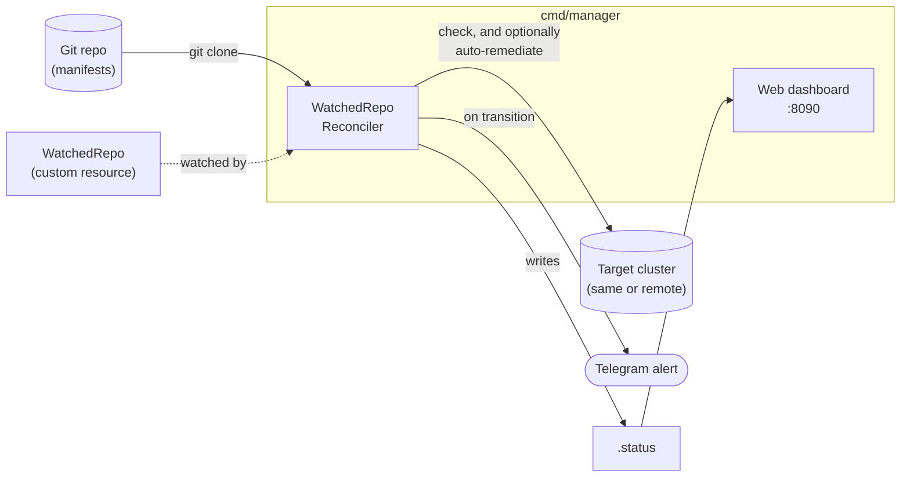

# gitops-drift-detector

[](https://github.com/Orhevba/gitops-drift-detector/actions/workflows/ci.yml)
[](https://go.dev)
[](https://github.com/kubernetes-sigs/controller-runtime)
[](LICENSE)

A Kubernetes operator that watches for **GitOps drift** — where the live
cluster no longer matches what's declared in Git — and can optionally fix
it automatically. Built as a from-scratch `controller-runtime` operator
(no Kubebuilder/Operator SDK scaffolding) with its own CRD, multi-cluster
support, a web dashboard, and Telegram alerting.

```
MISSING  → declared in Git, never deployed
DRIFTED  → deployed, but fields differ from Git
ORPHAN   → running in the cluster, not declared in Git
IN SYNC  → matches
```

Only fields actually present in the Git manifest are compared — fields
the cluster/API server adds on its own (`status`, defaults, etc.) are
ignored, so a resource never shows as drifted just because Kubernetes
filled in something Git never mentioned.

## Features

- **Two ways to run it** — a one-shot CLI (`cmd/check`) for local/CI use,
  or a real in-cluster controller (`cmd/manager`) reconciling a
  `WatchedRepo` CRD on a schedule. Both share the same core logic.
- **Plain manifests or Kustomize**, auto-detected.
- **Optional auto-remediation** via server-side apply — creates missing
  resources and fixes drifted ones, off by default.
- **Multi-cluster** — one manager can check `WatchedRepo`s against other
  clusters via a referenced kubeconfig Secret, not just its own.
- **Telegram alerts** on real sync-state transitions (not spammy re-alerts
  on unchanged, long-standing drift).
- **Web dashboard** showing every `WatchedRepo` and its live status.

## Architecture



## Why this project

Built as a portfolio piece to demonstrate real Kubernetes depth for
DevOps roles — specifically the controller/CRD/reconcile-loop pattern
that Kubernetes itself is built out of, rather than just `kubectl`
usage. It was built and tested end-to-end against a real k3s cluster,
which surfaced (and fixed) several genuine bugs a code read-through
alone wouldn't have caught — a self-triggering reconcile loop, a
false-positive drift bug on list fields, and a notification gap around
auto-remediation. See the project's git history for the full story.

## Prerequisites

- Go 1.22+
- A kubeconfig pointing at your cluster (e.g. k3s: usually
  `/etc/rancher/k3s/k3s.yaml`, or copy it to `~/.kube/config`)

## CLI usage (`cmd/check`)

```sh
go mod tidy
go run ./cmd/check -manifests ./examples/manifests -namespace default
```

Point `-manifests` at your own repo of YAML files once you've verified it
works against the bundled example. Use `-kubeconfig` to target a specific
kubeconfig file if it's not in the default location or `$KUBECONFIG`.

Cluster-injected resources (e.g. `ConfigMap/kube-root-ca.crt`, which
Kubernetes adds to every namespace itself) are excluded from orphan
detection by default. Add your own exceptions with `-ignore`:

```sh
go run ./cmd/check -manifests ./examples/manifests -namespace default \
  -ignore "Secret/some-webhook-cert,ConfigMap/some-operator-cache"
```

Exit code is `1` if any drift was found, `0` if everything is in sync —
so it can be wired into CI.

## Running as a controller (`cmd/manager`)

This is the "real operator" version: instead of you running a command, it
runs inside the cluster and reconciles `WatchedRepo` resources on a loop.

1. **Install the CRD and RBAC:**
   ```sh
   kubectl apply -f config/crd/watchedrepo-crd.yaml
   kubectl apply -f config/rbac/rbac.yaml
   ```

2. **Build the image.** On a single-node k3s VM with no registry, the
   simplest path is building directly on that VM (copy the repo over, or
   `git clone` it there):
   ```sh
   docker build -t gitops-drift-detector:latest .
   ```
   If you're building elsewhere and need to get the image onto the k3s
   node, save and import it instead of pushing to a registry:
   ```sh
   docker save gitops-drift-detector:latest | ssh <vm> 'sudo k3s ctr images import -'
   ```

3. **Deploy the manager:**
   ```sh
   kubectl apply -f config/manager/deployment.yaml
   ```

4. **Create a `WatchedRepo`** (see `config/samples/watchedrepo-sample.yaml`
   for the shape) pointing at a real Git repo, then watch it get checked:
   ```sh
   kubectl apply -f config/samples/watchedrepo-sample.yaml
   kubectl get watchedrepos -A -w
   kubectl get watchedrepo demo -n drift-system -o yaml   # full status, including per-resource drift
   ```

RBAC note: the manager is granted broad cluster-wide read access (`get`/
`list`/`watch` on `*`/`*`), because a `WatchedRepo` can reference any
resource kind — the checker can't know ahead of time what to scope down
to. Fine for a personal cluster; tighten `config/rbac/rbac.yaml` to
specific apiGroups/resources before running this anywhere that matters.

### Ignoring specific resources

A namespace usually has things in it that were never meant to be tracked
in Git — a Helm-managed release, for instance, which already has its own
tool (`helm upgrade`) managing it and doesn't need a second one claiming
ownership via a duplicated manifest. Rather than writing a manifest just
to make the `ORPHAN` warning go away, exclude it explicitly with
`spec.ignore` (a list of `"Kind/name"` strings, same format as the CLI's
`-ignore` flag):

```sh
kubectl patch watchedrepo demo -n drift-system --type merge \
  -p '{"spec":{"ignore":["Deployment/my-release"]}}'
```

Note this is a JSON *merge* patch, so it replaces the whole `ignore`
list rather than appending to it — include every entry you want kept
each time, e.g. `{"ignore":["Deployment/my-release","ConfigMap/some-cache"]}`.
The same field can be set directly in a `WatchedRepo`'s YAML instead of
patching it:
```yaml
spec:
  ignore:
    - Deployment/my-release
    - ConfigMap/some-cache
```

`ConfigMap/kube-root-ca.crt` (which Kubernetes injects into every
namespace automatically) is excluded by default, always, on top of
whatever you add here.

## Drift notifications (Telegram)

The manager sends a Telegram message whenever a `WatchedRepo` **changes**
state (goes out of sync, or recovers) — not on every poll, so a
long-standing drift doesn't re-alert every `pollInterval` forever.

1. Message [@BotFather](https://t.me/BotFather) on Telegram, send `/newbot`,
   follow the prompts, and copy the bot token it gives you.
2. Send your new bot any message (in a DM, or add it to a group), then find
   your chat ID:
   ```sh
   curl -s "https://api.telegram.org/bot<TOKEN>/getUpdates" | grep -o '"chat":{"id":[0-9-]*'
   ```
3. Set both as environment variables. Locally (testing with `go run
   ./cmd/manager`):
   ```sh
   export TELEGRAM_BOT_TOKEN=<token>
   export TELEGRAM_CHAT_ID=<chat-id>
   go run ./cmd/manager
   ```
   In-cluster, create a Secret instead (see `config/manager/deployment.yaml`
   for the exact keys expected):
   ```sh
   kubectl create secret generic gitops-drift-detector-telegram \
     -n drift-system \
     --from-literal=token=<token> \
     --from-literal=chat-id=<chat-id>
   ```

If neither variable is set, notifications are silently disabled (a no-op)
— everything else still works.

## Auto-remediation (optional, off by default)

By default this tool only *reports* drift. Set `autoRemediate: true` on a
`WatchedRepo` and it will also *fix* it: missing resources are created,
and drifted ones are patched back to match Git — via [server-side
apply](https://kubernetes.io/docs/reference/using-api/server-side-apply/),
so it only touches the fields it manages rather than overwriting fields
other tools or the cluster itself own.

```yaml
spec:
  autoRemediate: true   # create MISSING and fix DRIFTED resources
  pruneOrphans: true    # also delete resources not declared in Git (no effect without autoRemediate)
```

**Read this before turning it on:**
- `pruneOrphans: true` means the controller will `kubectl delete` anything
  in the target namespace of a kind your manifests use, that isn't in
  Git. If your manifests declare a `ConfigMap`, *every* `ConfigMap` in
  that namespace not in Git gets deleted, including ones you didn't
  realize were untracked. Start with `autoRemediate: true` and
  `pruneOrphans` left off, and only enable pruning once you're confident
  the namespace only contains what you expect.
- The manager's RBAC (`config/rbac/rbac.yaml`) grants
  `create`/`update`/`patch`/`delete` cluster-wide the moment it's
  installed at all — remediation isn't gated per-`WatchedRepo` at the
  RBAC layer, only in application logic. Anyone who can edit a
  `WatchedRepo` can turn on cluster-wide write access for the manager's
  identity.
- After remediating, the controller re-checks rather than assuming the
  patch worked (a patch can be accepted without producing the expected
  result, e.g. hitting an immutable field) — but that only catches
  *detectable* problems, not every possible side effect of an automated
  write to your cluster.

## Multi-cluster

One manager (running in one cluster) can check `WatchedRepo`s against
*other* clusters too, not just its own. Point a `WatchedRepo` at a
Secret in its own namespace holding a kubeconfig for the target cluster:

```yaml
spec:
  kubeconfigSecretRef:
    name: staging-cluster-kubeconfig
    key: kubeconfig   # optional, this is the default
```

```sh
kubectl create secret generic staging-cluster-kubeconfig \
  -n drift-system \
  --from-file=kubeconfig=/path/to/staging.kubeconfig
```

Omit `kubeconfigSecretRef` (the default) and the manager checks its own
cluster, same as before. The manager's own RBAC already covers reading
this Secret (see the broad grant note above) — there's no separate
permission to set up.

## Web dashboard

The manager also serves a small read-only dashboard listing every
`WatchedRepo` it knows about — namespace, target repo/path/cluster,
in-sync status, current drift, its poll interval, and an *estimate* of
the next check time (`Last Checked` + the effective poll interval) —
refreshing every 30s. That estimate is exactly that: an estimate,
computed client-side from the last known check time, not a live
countdown — the actual next reconcile can also be triggered early by a
`spec` change (see `kubectl patch ... pollInterval` earlier in this doc).

Locally (`go run ./cmd/manager`), it's just `http://localhost:8090`.

In-cluster, the Service is `type: LoadBalancer` — on a single-node k3s
cluster, k3s's built-in load balancer (Klipper) binds that port directly
onto the node's own IP, so it's reachable straight away at
`http://<node-ip>:8090/`, no port-forward required. If you'd rather not
expose it on the network at all, switch the Service back to `ClusterIP`
and use port-forward instead:
```sh
kubectl port-forward svc/gitops-drift-detector-dashboard 8090:8090 -n drift-system
```
then open `http://localhost:8090`. Change `--dashboard-bind-address` (or
the Service in `config/manager/deployment.yaml`) if you want it exposed
differently — it has no authentication of its own, so don't put it on
the open internet without adding some.

## Testing

```sh
go test ./... -v -cover
```

Covered:
- The diff engine (`internal/drift`) — including regression tests for the
  two real correctness bugs found by testing against a live cluster (a
  false-positive on list fields like containers, and the "only compare
  fields Git actually mentions" behavior).
- Manifest loading — plain YAML directories and Kustomize overlays
  (including that an overlay patch, e.g. a replica count override,
  actually gets applied).
- The Telegram notifier — request shape and error handling, against a
  local `httptest` server rather than the real API.
- Multi-cluster config resolution (`restConfigFor`) — using
  `controller-runtime`'s fake client, no real cluster needed.

**Deliberately not covered:** `drift.Check`/`drift.Remediate`'s actual
cluster interaction, and the full `Reconcile` loop end-to-end. Testing
those properly needs either `envtest` (a real API server binary
Kubebuilder-based projects download and run in CI) or a much deeper fake
`dynamic.Interface`/`RESTMapper` — both are more infrastructure than this
project's size currently justifies. In practice, that gap is exactly why
this project was built and tested against a real k3s cluster throughout
instead of only trusting unit tests — see the bugs section in the git
history (and `~/Documents/gitops-drift-detector-journey.md`, if you have
it) for what that caught that tests alone wouldn't have.

CI (`.github/workflows/ci.yml`) runs `gofmt -l`, `go vet`, `go build`,
and this test suite on every push/PR.

## Roadmap

- [x] Rebuild as a controller (`controller-runtime` + CRD)
- [x] Support Kustomize overlays, not just plain YAML
- [x] Alert on drift (Telegram; Slack/other webhooks can reuse the same `notify.Notifier` interface)
- [x] Optional auto-remediation (apply Git's version to fix drift automatically, via server-side apply)
- [x] Multi-cluster support (a `WatchedRepo` can target a different cluster than the manager's own, via a kubeconfig Secret)
- [x] Web dashboard listing every `WatchedRepo` and its status
- [x] Unit tests + CI (GitHub Actions)
